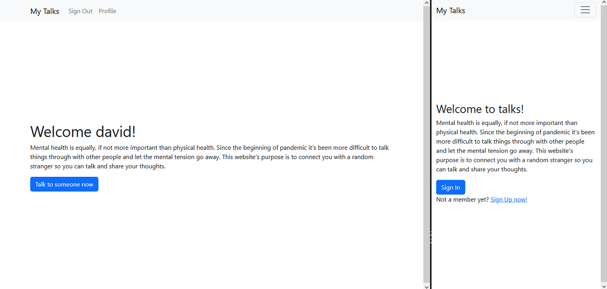
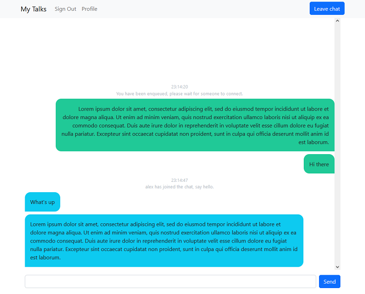

# My Talks
My talks is a chat application connecting you with other random stranger. 
Server is created with Flask, SocketIO and SQLalchemy.
Jinja templates styled with bootstrap are used for the frontend.

## Demo
* App demo is hosted on https://my-talks.fly.dev
* Demo accounts -> listener@test.com / talkie@test.com / both with password -> A1+

## Content
When opening the app, you can either sign in or sign up. After either of these, your input is validated and user session is created.
Hence, you can enter the chat screen where you might wait for someone else to connect.
If you accidentally press refresh button or accidentally close the browser your connection to the other user is not lost, you will be reconnected (the messages will be lost). 
After pressing leave button, you can write few words about your experience.

## Project description
#### Flask is used to handle HTTP requests and serves jinja templates.
There are several endpoints ["/", "/signup", "/signin", ...] which can be used via GET or POST request.
Access to some might be possible only when signed in ["/chat", "/profile", ...] or signed out ["/signin", "/signup", ...]

#### SQLalchemy handles User and Review data
User data as email, username and hashed password are stored in SQLite database. 
All database operations are handled via SQLalchemy.

#### SocketIO enables live chat messages to be sent between two clients
After entering /chat subpage, 
new socketio connection is created and the user is either connected to user with opposite role at the front of the queue, 
or is enqueued and waits for other user to connect.

## Screenshots

## How to run locally in venv
1. python -m venv ./
2. .\Scripts\activate
3. pip install -r requirements.txt
4. python server.py

## Todo
* Write unit tests
* Use logger

## Changelog
* / 59f1d1f / Swithed from vanilla Sqlite to SQLalchemy
* / 59f1d1f / Changed error message style in forms

